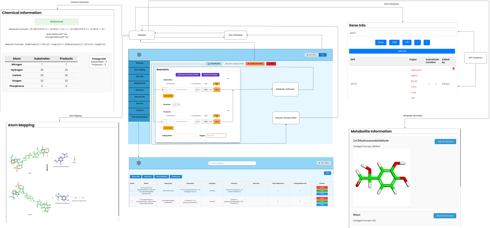

# Reconstructor
This tool is for the curation of reconstruction reactions. It allows users to preview, save and run tests on reactions of their choice.

It is live on http://reconstructor.humanmetabolism.org/

## Installation and Setup (to run locally)
To get started with the Reconstruction Curation Tool, follow these steps to set up the environment on your local machine.
### Prerequisites
Ensure you have the following installed:
- Python (version 3.10.12)
- Django (version 5.0.1)
- RDT - https://github.com/asad/ReactionDecoder/releases (v2.4.1)

### Run the Application
1. Make sure you have postgresql or another DB management system
2. Specify the database name, user and password in reactions_project/settings.py\
3. Execute the following commands:\
`pip install -r requirements. txt`\
`python manage.py runserver`
## Architecture Overview

Below is the architecture diagram for the project:

## Code Structure
### HTML Files
1. **Home_page.html**
    - Head Section: Includes meta tags, page title, and links to various CSS stylesheets and external libraries such as jQuery and Semantic UI.
    - Top Navigation Bar: Contains user-related elements like login buttons, user display, and status messages.
    - Side Navigation Menu: A vertical menu provides navigation buttons for various sections like "Reactants," "Atom Mapping," ,"Chem Info","Metabolite   Info","References" ,"External Links","Gene Info","Comments", "View Saved Reaction"
    - Main Content Area: Hosts multiple content divs for different functionalities (e.g., form for reactants input, atom mapping, chemical info).
    - Form Elements: Includes forms for creating and submitting reactions, with input fields for substrates, products, and subsystem tagging.
    - Modal Dialogs: Multiple modals are defined for tasks like login, registration, saving reactions, selecting reactions from vmh and rhea and  selecting  reaction templates.
    - JavaScript Integration: Several scripts are loaded for handling user interactions, AJAX requests, form validation, and dynamic content updates.
    - External Libraries: Uses external libraries such as jQuery, Semantic UI, and FontAwesome for enhanced user interface components and icons.
    - Footer Section: Contains funding acknowledgment with logos and texts, displaying the funding sources for the project.
2. **saved_reactions.html**
    - Displays a list of saved reactions for a given user.
    - Each reaction entry includes details like name, substrates, products, and chemical formula.
    - Provides options to view more details or delete a reaction. **(this is now in static/reactions/js_savedreactions/reactionViewAndDelete.js)**
    - Add to VMH Button Handling: Integrates a user interface component for submitting selected reactions to be added to the VMH database **(this is now in static/reactions/js_savedreactions/hadleAdd2VMH.js)** :
        - JavaScript functionality to manage user selections of reactions for submission.
        - Dynamic generation of a modal window that previews selected reactions, allowing users to review and provide additional details before submission.
        - Validation to ensure all required information is provided for each selected reaction, with user-friendly error messages for missing data.
        - Communication with the backend views.py function add_to_vmh through AJAX, submitting the detailed reaction information.
        - Receive feedback on the process, including loading indicators and success or error messages upon completion.
3. **chemdoodle_sketcher.html**
    - Dedicated page for the ChemDoodle sketcher.
    - Includes necessary ChemDoodle Web components and scripts.
    - Provides functions for getting molecule data, loading molecules into the sketcher, and clearing the sketcher.
    - This is used as a sub-page in the **Home_page.html** when a user wants to draw a molecule.

4. **leaderboard.html**
    - Styles and Scripts: Links external CSS (Bulma, Google Fonts) and JavaScript (Chart.js), along with Django static files for custom styles of bar chart and scripts.
    - Chart Area: A full-width column containing a <canvas> element for displaying a chart using Bulma.
    - Stats Title: A centered title heading for the stats section.
    - Leaderboard Table: A responsive table to display leaderboard data, structured with headers and an empty body to be populated dynamically.

### CSS Files
1. **Home_page.css**
    - Styles for the **Home_page.html** page.
    - Defines layout for form fields, buttons, modals, and containers.
    - Ensures responsive design for different screen sizes.
    - Includes custom styles for error messages and status indicators.
2. **saved_reactions.css**
    - Styles for the **saved_reactions**.html page.
    - Focuses on list styling and reaction information presentation.
    - Customizes buttons for viewing and deleting reactions.
    - Ensures readability and clear layout for reaction lists.
3. **leader_board.css**
   - Styles for the **stats** page of the Reconstructor application.
   - Focuses on the layout and presentation of the leaderboard and associated charts.
   - Ensures a clean and responsive design with clear text and interactive elements.
   - Customizes the table for displaying reaction statistics, including alternating row colors, hover effects, and column widths.
   - Provides responsive adjustments for different screen sizes.
   - Incorporates consistent styling for buttons, modals, and tooltips to enhance user interaction and readability.
4. **reactioninfo.css**
   - Styles for the **reaction information** section, focusing on input forms, buttons, and table-like data presentation.
   - Provides a clean and consistent layout for entering and displaying reaction-related information.
   - Ensures responsive and user-friendly design with hover and focus effects for interactivity.
   - Customizes the appearance of dropdowns, input fields, and buttons for a cohesive look and feel.
   - Implements flexible layouts for containers, making sure content is well-aligned and easy to interact with.
   - Table-like structures are styled to resemble tables while maintaining a flexible layout using div elements.
5. **reactants.css**
   - Styles for the **reactants** section, focusing on the layout and interaction of various input fields, buttons, and dropdowns.
   - Provides a consistent design for input containers, buttons, and tooltips related to reactants and products in chemical reactions.
   - Ensures a responsive and user-friendly interface with clear visual feedback, such as hover effects and focus states.
   - Customizes the appearance and behavior of dropdown menus, including options for substrates, products, compartments, and other reaction-related details.
   - Implements flexible layouts for input groups and button containers, making sure content is well-aligned and easy to interact with.
   - Includes specific styles for displaying and interacting with modal dialogs, tooltips, and status indicators, enhancing the overall user experience.
6. **metabolite-div.css**
   - Styles for the **metabolite** sections, focusing on the layout and presentation of metabolite information.
   - Provides consistent styling for metabolite containers with padding, borders, and background colors to enhance readability.
   - Customizes the header of each metabolite section, ensuring proper alignment and spacing between elements.
   - Implements styles for a toggle button, including active and hover states, to allow user interaction with metabolite data.
   - Ensures a user-friendly design with smooth transitions and visual feedback for interactive elements like buttons.

### JavaScript Files
### **js**
1. **chemdoodleIntegration.js**
    - Modular Integration with ChemDoodle: Provides functions to integrate and manage ChemDoodle sketcher within the application.
    - Modal Display Control: Contains `hideChemdoodlestatus` function for showing or hiding the ChemDoodle sketcher modal based on user interaction.
    - Event Listener Attachment: Implements `attachEventListenersToSelects` for attaching event listeners to select elements, allowing dynamic interaction with the sketcher.
    - Dynamic Button Management: Functions `addStartDrawingButton`, `removeStartDrawingButton`, and `removeEditDrawingButton` manage the addition and removal of drawing-related buttons based on user selections.
    - ChemDoodle Interaction: `setCurrentlyDrawing` and `clearCurrentlyDrawing` functions manage the state of which molecule is currently being drawn or edited.
    - Molecule Data Handling: `saveDrawing` function handles the extraction of molecule data from the ChemDoodle sketcher, prompts for a molecule name, and updates the corresponding input fields.
    - Editing Functionality: `editDrawing` and `replaceStartWithEditButton` provide functionality to edit existing molecule drawings, including retrieving and sending data back to the ChemDoodle sketcher.
2. **Creatediv.js**
    - Mapping Buttons to Divs: The button_to_div object serves as a mapping between sidebar button IDs and corresponding div names. This allows for a clean and scalable way to associate each button with a specific content section.

    - Event Listener Initialization: When the document is fully loaded (DOMContentLoaded event), the code selects all elements with the class .dynamic-button-side-button. It iterates through these buttons and checks if the button's ID exists in the button_to_div mapping.

    - Toggle Visibility: When a button is clicked:
        - It checks the corresponding div’s current display status.
        - If the div is visible (display: block), the code hides the div and removes the 'active' class from the button.
        - If the div is hidden, it shows the div and adds the 'active' class to the button.

    - Dynamic Button State Management: The refreshSideButtons function is used to synchronize the button states with the visibility of the corresponding divs
    - It iterates through the button_to_div entries.
    - For each entry, it checks if the associated div is visible.
    - If the div is visible, it adds the 'active' class to the button; otherwise, it removes the class.
    - Initial State Synchronization: The refreshSideButtons function is called on window.onload, ensuring that when the page is loaded or refreshed, the    sidebar buttons reflect the correct state based on which divs are currently visible.

3. **Displayalldivs.js**
    - Loading Div Data: The first three function calls (loadAtomMappingDiv, loadChemInfoDiv, loadMetaboliteInfoDiv) populate the relevant divs with data from reactionData.

    - Updating Status Dots: The updateStatusDots function is called twice to update the status dots for both substrates and products, indicating whether metabolites were found.

    - Displaying Additional Information: displayReactionMessage and displayreactioninfo functions are used to show other relevant reaction information.

    - Refresh Side Buttons: Finally, refreshSideButtons is called to ensure that the state of the side buttons accurately reflects the visibility of the divs.

4. **displayAtomMapping.js**
    - Message Container Initialization:
        - The function begins by selecting the reactionFoundMessage element to potentially display messages.
        - The contentDiv associated with atom mapping is also selected for further manipulation.
        - It clears any previous messages in the reactionFoundMessage element.
    - Error Handling:
        - If reactionData contains an error, it formats the error message (replacing line breaks with HTML   tags).
        - The error message is then displayed in a modal (#error-modal), and the page scrolls to the top to ensure visibility.
    - Updating Atom Mapping Image:
        - If no error is present, it first retrieves the existing image element (reactionImage) in the contentDiv.
        - The function stores relevant attributes (class, name, id) of the image and then removes the old image element.
        - A new image element is created with the same attributes and a new source URL that includes a cache buster to prevent caching issues.
        - The new image element is then appended to the contentDiv.
    - Blowup Effect:
        - After the new image has loaded, a "blowup" effect is applied to it using jQuery, which allows for a zoomed-in view of the image when hovered over. The lens is customized in size and appearance (https://github.com/paulkr/blowup.js).
    - Div Visibility:
        - Finally, the contentDiv is set to be visible (display: block) to ensure the updated content is shown to the user.

5. **displayChemInfoDiv**
    - **Purpose**: Dynamically generates and displays chemical information based on the provided `reactionData`.
    - **Parameters**: 
        - `reactionData`: Object containing data related to the chemical reaction.
    - **Functionality**:
        - Clears and sets up the main content area (`contentDiv`) for displaying chemical information.
        - Creates and appends a status text indicating whether the reaction is balanced in terms of atoms and charge.
        - Dynamically assigns colors to atom types and displays them in the molecular formula.
        - Displays mass and charge balance information.
        - Handles the creation and display of reaction formulas, including user interaction elements (input fields, dropdowns, and buttons) for unrecognized metabolites.
        - Includes a "Save All" button that automates the saving of user inputs by triggering all relevant actions and sending data to the backend.
        - Constructs and appends a comparison table showing atom counts in substrates and products, highlighting discrepancies.
        - Generates distinct colors for atom types using the `getDistinctColors` function.
    - **Helper Functions**:
        - `populateAtomComparisonTable()`: Populates a table comparing atom counts between substrates and products, along with charge information.
        - `getDistinctColors()`: Generates distinct colors for atom types based on the golden angle approximation.
    - **Loader Functions**:
        - `showLoaderdiv(message)`: Displays a loader with a modal background and a custom message.
        - `hideLoaderdiv()`: Hides the loader and modal background after the operation is complete.
    - **User Interaction**:
        - Includes dropdowns and input fields for user to manually input abbreviations for unrecognized metabolites.
        - Automatically saves and updates formulas based on user interactions.

6. **displayMetaboliteInfo.js**
    - **loadMetaboliteInfoDiv(reactionData)**
        - **Purpose**: Initializes and displays the metabolite information section within a specified content div.
        - **Parameters**: 
            - `reactionData`: Object containing data related to the metabolites involved in a reaction, including their names, formulas, and molecular structures.
        - **Functionality**:
            - Checks if the metabolite information div is present in the DOM.
            - Sets up the header for the metabolite information section.
            - Calls `fillMetaboliteInfoTab` to populate the section with detailed metabolite information.
        - **Error Handling**: Logs an error to the console if the metabolite info div is not found.

    - **fillMetaboliteInfoTab(data)**
        - **Purpose**: Populates the metabolite information section with details about each metabolite, including the name, charged formula, and a toggleable 3D structure viewer.
        - **Parameters**:
            - `data`: Object containing metabolite data, including names, formulas, and 3D structure data in SDF format.
        - **Functionality**:
            - Iterates through each metabolite and creates a div container to hold the metabolite's name, formula, and a button to toggle the 3D structure viewer.
            - If the user clicks the "Show 3D Structure" button, it initializes a 3Dmol.js viewer with the corresponding molecular structure and displays it.
            - The 3D structure is hidden by default and can be toggled on/off by the user.
        - **3D Viewer Initialization**:
            - Configures and renders a 3D structure viewer using 3Dmol.js.
            - Allows the user to click on atoms to display labels in the 3D structure.
        
    - **toggleStructure()**
        - **Purpose**: Adds event listeners to buttons that toggle the visibility of additional content (such as 3D structures or messages) associated with each metabolite.
        - **Functionality**:
            - Attaches click event listeners to all elements with the class `toggle-button`.
            - Toggles the visibility of a sibling element (e.g., 3D structure container) and updates the button text accordingly.
        - **Use Case**: General-purpose function for toggling the display of content sections in the metabolite information div.

7. **displayReactionMessage.js**
    - **Purpose**: Displays a message indicating whether the reaction data was found on the VMH (Virtual Metabolic Human) database and provides a link to the relevant VMH page if available.
    - **Parameters**:
        - `reactionData`: Object containing information about the reaction, including whether it was found on VMH, if it's an exact or similar match, and the VMH URL.
    - **Functionality**:
        - Clears any previous messages in the `reactionFoundMessage` container.
        - Checks if the reaction was found on VMH:
            - If found, displays a message indicating whether the match is exact or similar.
            - Provides a clickable link to the VMH entry.
        - If the reaction is not found, displays a message stating "Reaction not found at VMH".
        - Ensures the message is visible by setting the display style of the message container to `block`.

8. **displaysavedReaction.js**
    - **Functionality**:
        - Attaches a click event listener to the `viewsavedreactions-button`.
        - When the button is clicked:
            - **If the user is logged in**:
                - Retrieves the `userID` from `sessionStorage`.
                - Redirects the user to the `/saved_reactions` page to view their saved reactions.
            - **If the user is not logged in**:
                - Displays an error message prompting the user to log in before they can view saved reactions.
                - Calls `showErrorModal(errorMessage)` to display the error in a modal window.

9. **flag.js**
    - **General Overview**
        - Manages the creation, selection, and display of custom flags for a user, including loading existing flags and submitting new ones.

    - **openCreateFlagModal()**
        - **Purpose**: Opens the interface for creating a new flag and hides the save reaction interface.

    - **closeCreateFlagModalAndReopenSaveReaction()**
        - **Purpose**: Closes the flag creation interface and reopens the save reaction interface.

    - **updateColorDisplay()**
        - **Purpose**: Updates the visual display to reflect the color of the currently selected flag.

    - **loadFlags()**
        - **Purpose**: Loads the user's existing flags from the server and updates the selection options accordingly.

    - **submitCreateFlagButton Event Listener**
        - **Purpose**: Handles the submission of a new flag to the server, reloads the flag list, and reopens the save reaction interface upon success.

    - **Initial Flag Loading**
        - **Purpose**: Automatically loads the user's flags when the page is accessed, provided the user is logged in.

10. **geneinfoinput.js**
    - **General Overview**
        - Manages the creation and handling of gene information input, including user interactions for adding gene symbols, logical operators (AND, OR), and parentheses within an editable field.

    - **createGeneInfoInput()**
        - **Purpose**: Initializes the gene information input section, including an editable area for gene input and a set of buttons for logical operations.
        
    - **createButton(label)**
        - **Purpose**: Creates a button with the specified label and assigns an event listener to handle the corresponding action when the button is clicked.
        
    - **handleButtonClick(label)**
        - **Purpose**: Handles the actions triggered by different buttons, such as inserting logical operators or gene symbols into the input field or opening a modal for gene input.

    - **getCursorPosition()**
        - **Purpose**: Retrieves the current cursor position within the editable input area, which is used to correctly insert text at the desired location.

    - **disableKeyboardInput()**
        - **Purpose**: Disables certain keyboard inputs within the gene information input field, allowing only specific keys such as Backspace and arrow keys.

    - **insertTextAtCursor(textToInsert, cursorPosition)**
        - **Purpose**: Inserts the specified text at the current cursor position within the input field and ensures the inserted text is non-editable.

    - **placeCursorAtEnd(element)**
        - **Purpose**: Moves the cursor to the end of the content within the specified element, typically used after inserting text.

    - **createAndShowModal(onConfirm)**
        - **Purpose**: Creates and displays a modal window for entering gene information, allowing the user to input and confirm gene symbols or IDs.

    - **submitGeneInfo(inputValue, selectValue)**
        - **Purpose**: Submits the gene information to the server and returns the corresponding gene symbol if successful.

    - **clearSession()**
        - **Purpose**: Sends a request to the server to clear the current session, handling any errors that may occur during the process.

11. **getreactionfromvmhandrhea.js**
    - **General Overview**
        - Manages user interactions and data fetching related to retrieving reaction information from VMH (Virtual Metabolic Human) and RHEA databases based on user input.

    - **handleReactionSelectChange()**
        - **Purpose**: Handles changes in the reaction source selection dropdown. Updates the state of the input field and the submit button based on the selected source (VMH or RHEA).
        - **Functionality**:
            - Enables the input field and updates its placeholder based on the selected source.
            - Displays or hides the submit button depending on whether a valid source is selected.

    - **handleVmhFetch()**
        - **Purpose**: Fetches reaction data from the VMH database using the entered reaction abbreviation.
        - **Functionality**:
            - Sends a POST request with the reaction abbreviation to the server endpoint responsible for retrieving VMH data.
            - Handles the server response by updating form fields with the retrieved data or displaying an error message.

    - **handleRheaFetch()**
        - **Purpose**: Fetches reaction data from the RHEA database using the entered reaction ID.
        - **Functionality**:
            - Sends a POST request with the reaction ID to the server endpoint responsible for retrieving RHEA data.
            - Handles the server response by updating form fields with the retrieved data or displaying an error message.

    - **Initialization**
        - **DOMContentLoaded Event Listener**: 
            - Sets up event listeners for the reaction selection dropdown, submit button, and modal trigger.
            - Calls `handleReactionSelectChange()` on page load to ensure the input field and submit button are correctly initialized based on the selected reaction source.

12. **getrxnfromtemplate.js**
    - **General Overview**
        - Manages the interaction for selecting and applying a reaction template from a modal, including enabling buttons based on user selections and fetching the template data.

    - **Initialization**
        - **DOMContentLoaded Event Listener**: 
            - Sets up event listeners for the template selection dropdown, the button to show the modal, and the apply button.
            - Initializes the modal display and enables or disables the apply button based on the user's selection.

    - **Template Selection and Modal Display**
        - **Modal Trigger**: 
            - Displays the modal for selecting a reaction template when the corresponding button is clicked.

    - **Reaction Template Selection**
        - **Reaction Selection Dropdown**: 
            - Monitors changes in the dropdown selection and enables the apply button when a valid template option is selected.

    - **handleTemplateButtonClick(option)**
        - **Purpose**: Fetches the selected reaction template data from the server and updates the form fields with the retrieved data.
        - **Functionality**:
            - Sends a POST request with the selected reaction type to the server.
            - Processes the server response and updates the form with the template data.
            - Hides the modal after successfully applying the template.

    - **Button Interaction**
        - **Apply Template Button**:
            - Triggered when the user clicks the apply button. It fetches the selected template data and updates the form accordingly.

13. **login_modal.js**
    - **General Overview**
        - Handles user login, session management, and subsequent actions related to task handling within modals.

    - **Login and Logout Handling**
        - **Login Button Event Listener**:
            - Opens the login modal when the "Log in" button is clicked.
            - Logs the user out, clears session storage, and updates the UI when the "Log out" button is clicked.

        - **Modal Close Event Listener**:
            - Closes the login modal when the close icon is clicked.

        - **Form Submission Handling**:
            - Submits the login form using AJAX to authenticate the user.
            - On successful login, updates the session storage with user information, displays the user's name, and changes the button text to "Log out".
            - Displays the task modal after login and hides the login modal.

    - **Task Modal Handling**
        - **Go Back Button Event Listener**:
            - Fetches available reactions for the logged-in user and hides the task modal when the "Go Back" button is clicked.

        - **Cancel Button and Close Icon Event Listeners**:
            - Hides the task modal and overlay when the "Cancel" button or the close icon is clicked.

    - **fetchAvailableReactions(userId)**
        - **Purpose**: Fetches the list of available reactions for the logged-in user from the server.
        - **Functionality**:
            - Sends a POST request with the user ID to the server.
            - Handles the server response by either processing the data or logging an error.

    - **handleLoginResponse(data)**
        - **Purpose**: Handles the server's response after fetching available reactions.
        - **Functionality**:
            - If there are available reactions, redirects the user to the reaction page with the last reaction ID.
            - If no reactions are available, hides the login modal.

14. **OrganDropdown.js**
    - **General Overview**
        - Provides functionality for a custom tag input system where users can type or select organs from a dropdown menu, with added support for displaying and managing these tags.

    - **Tag Input and Dropdown Handling**
        - **Initialization**:
            - Sets up the input container and dropdown menu for organ selection.

        - **organTagsContainer Event Listeners**:
            - **Click Event**:
                - Opens the dropdown menu when the input container is clicked, allowing users to select organs from a predefined list.
            - **Keydown Event**:
                - Handles user input within the container, allowing users to add new tags by pressing Enter or comma.
                - Deletes the last tag when Backspace is pressed if the input area is empty.

    - **Dropdown Interaction**
        - **renderDropdown(items, dropdown)**:
            - Renders the dropdown menu with a list of selectable organs.
            - When an organ is clicked, it is added as a tag to the input container, and the dropdown is hidden.

        - **Global Click Event Listener**:
            - Closes the dropdown when the user clicks outside the input container or dropdown.

    - **Tag Management**
        - **addTag(tagText)**:
            - Adds a new tag to the input container based on user input or selection.
            - Prevents the addition of duplicate tags.
            - Ensures the cursor is properly positioned after adding a tag for seamless input continuation.

    - **Display Existing Tags**
        - **DisplayTag(tags)**:
            - Converts a string of tags into individual tag elements within the input container.
            - Used for initializing or restoring tags from a saved state.
            - Prevents duplicate tags and ensures proper tag structure with close buttons.

    - **Utility Functions**
        - **Organ List Handling**:
            - Filters and deduplicates a predefined list of organs, ensuring unique selections for the dropdown.
15. **reactantsdisplay.js**
    - **General Overview**
        - Initializes the user interface, manages session status, and sets up event listeners for a reaction display page.

    - **Initialization**
        - **DOMContentLoaded Event Listener**:
            - Sets up the initial state of the page once the DOM is fully loaded.
            - Checks if a user is logged in by verifying `sessionStorage` and updates the UI accordingly.
            - Sets the session user on the server and manages tooltips, reaction creation, gene info input, and reaction data display.

    - **Session Management**
        - **User Session Initialization**:
            - If the user is logged in, sets the user status and displays their username.
            - Sends a POST request to the server to set the session user, handling success and error responses.

    - **Page Setup and Event Handling**
        - **Tooltips and Event Listeners**:
            - Calls `setupTooltips()` to initialize tooltips on the page.
            - Attaches event listeners to various elements for handling user interactions, such as form submissions and button clicks.

        - **Reaction Handling**:
            - Fetches and updates reaction data if a reaction ID is present in the URL or if the action is set to 'edit'.
            - Displays relevant reaction data and UI elements based on the fetched data.
            - Fetches subsystem data if it is not already loaded and updates the UI.

        - **createnewreaction()**:
            - Sets up an event listener for the reset button that redirects the user to the homepage when clicked.

    - **Utility Functions**
        - **DisplayTag()**:
            - Displays tags for organs or other relevant data in the UI based on provided data.

        - **setLoggedInStatusBasedOnUrl()**:
            - Ensures the correct user session status is displayed based on the current URL.

16. **reactantsformhandling.js**
    - **General Overview**
        - Manages form submission, validation, and UI interactions for handling reactant inputs in a reaction creation or editing process.

    - **Form Submission Handling**
        - **submitBtn-form Event Listener**:
            - Triggers the form submission when the submit button is clicked, ensuring the default form submission behavior is prevented.
        
        - **reactionForm Event Listener**:
            - Handles the main form submission process, including validation of inputs and subsystem fields, enabling/disabling form fields, and managing the loading indicator during the submission.
            - If the form is valid, the data is sent via a POST request to the server for processing.
            - Upon success, the page is redirected based on the action (create or edit).

    - **Modal and Loading Indicator Management**
        - **hidemodal()**:
            - Hides the error modal when called.

        - **showLoader() and hideLoader()**:
            - Controls the visibility of a loading indicator during form processing.

        - **showErrorModal(message)**:
            - Displays an error message in a modal window to inform the user of any issues during form submission or validation.

    - **Validation and User Interaction**
        - **Subsystem Validation**:
            - Validates the subsystem field to ensure it is filled and prompts the user to confirm if a new subsystem needs to be added.
            - Updates the subsystem list if the user confirms the addition of a new subsystem.

        - **Metabolite Name Validation**:
            - Ensures that all required metabolite names are entered before allowing form submission.

    - **Supporting Functions**
        - **persistSubsystemList(newSubsystem)**:
            - Sends a POST request to update the subsystem list on the server with a new entry.

        - **updateStatusDots(containerId, foundList, miriamsList) and updateStatusDot(dot, found, miriam)**:
            - Updates the visual status indicators (dots) associated with metabolite validation, including whether they are found in VMH and linked to external resources.

        - **confirmAll()**:
            - Triggers confirmation actions on all relevant form fields, ensuring that all necessary data is validated and confirmed.

        - **setupTooltips()**:
            - Sets up tooltips for additional information on certain UI elements, enhancing the user experience by providing contextual help.

17. **reactantsinputfieldmanagement.js**
    - **General Overview**
        - Manages the interaction and validation of input fields for substrates and products within a reaction form. This includes dynamic field addition, input validation, and dropdown handling.

    - **Subsystem Dropdown Handling**
        - **subsystemField Event Listener**:
            - Filters and displays matching subsystem options in a dropdown as the user types.
            - Fills the input field with the selected subsystem when a dropdown option is clicked.

        - **Document Click Event Listener**:
            - Closes the subsystem dropdown when the user clicks outside the input field or dropdown.

    - **Placeholder Management**
        - **updatePlaceholder(selectElement, inputElement)**:
            - Updates the placeholder text of an input field based on the selected type from a dropdown (e.g., "VMH Abbreviation", "ChEBI ID").
            - Initializes the placeholder text based on the current selection.

    - **Field Management**
        - **addField(containerId, inputName, numberName)**:
            - Dynamically adds a new input field for substrates or products, including compartments and type selectors.
            - Adds necessary event listeners for input validation and file handling.

        - **addFieldWithData(container, name, schName, value, schValue, compValue, type, metab_name=null)**:
            - Adds a new input field with pre-filled data for substrates or products, useful for editing existing reactions.

        - **removeField(button)**:
            - Removes an input field group when the corresponding "Remove" button is clicked.

    - **Compartment and Type Management**
        - **applyAllSubsComps** and **applyAllProdsComps**:
            - Applies the selected compartment value to all substrate or product compartment dropdowns.

        - **applyAllSubsType** and **applyAllProdsType**:
            - Applies the selected type to all substrate or product type dropdowns.
            - Updates the corresponding input fields and toggles file inputs if necessary.

    - **Event Listener Initialization**
        - **attachEventListenersToDoneButtons() and attachEventListenersToDoneAllButtons()**:
            - Sets up event listeners for "Done" and "Done All" buttons to handle metabolite verification and input validation.

        - **toggleRotation(event)**:
            - Toggles a rotation class on an image element within a button, typically used to indicate an expanded/collapsed state.

        - **toggleFileInput(container, selectValue)**:
            - Toggles between text and file input fields based on the selected type in the dropdown (e.g., "MDL Mol file" shows a file input).

    - **Field Update and Validation**
        - **updateFormFields(data)**:
            - Populates the form fields with substrate and product data from a provided dataset, typically used when editing a reaction.

        - **handleDoneButtonClick(event) and handleDoneAllButtonClick(event)**:
            - Validates and processes individual or all metabolite inputs, verifying them against a database and updating the UI accordingly.

        - **updateNameFields(data, main_input, typeField, button, showButton)**:
            - Updates hidden name fields and visual indicators based on the verification results of a metabolite input.
            - Manages the state of the input fields and related buttons based on whether the metabolite was found in the database.

18. **reactioninfoformhandling.js**
    - **General Overview**
        - Manages the interaction, submission, and display of reaction-related information such as comments, references, external links, and gene information within a reaction form.

    - **Variable Initialization**
        - **infoType, extLinkType, refType**:
            - Variables to hold the type of information being processed, determined by the user's interaction with specific sections of the UI.

    - **Event Handling for Information Sections**
        - **Event Listener for `.content-div` elements**:
            - Sets up click event listeners for different sections (comments, references, external links, and gene info).
            - Adjusts the `infoType`, `extLinkType`, and `refType` variables based on the clicked section.
            - Calls `setupSubmitHandler()` to initialize form submission handling based on the selected section.

    - **Form Submission Handling**
        - **setupSubmitHandler(submitButtonId, Infotextid)**:
            - Configures the submit button for the specific section based on user interaction.
            - Handles data preparation and submission for the selected section, including making POST requests for gene information parsing.

        - **submitData(data)**:
            - Submits the prepared data to the server using a POST request.
            - Upon successful submission, updates the UI by fetching and displaying the relevant reaction details (comments, references, external links, gene info) in the corresponding tabs.

    - **Gene Information Management**
        - **Gene Info Processing**:
            - Handles the special case of gene info submission, where gene information is parsed and organ locations are added before submission.
            - **AddOrganLocation(data)**:
                - Submits gene information to the server to retrieve organ and subcellular location data before final submission.

        - **parseInfo(info)**:
            - Parses gene information to extract GPR, organ, and subcellular location details from the input text.

        - **deleteGeneInfoFromSession(itemToDelete)**:
            - Deletes gene information from the session data upon user confirmation.

    - **Tab Content Display**
        - **displayTabContent(tableId, reaction_info, reaction_id)**:
            - Dynamically populates the content of a specified tab (comments, references, external links, gene info) with the fetched reaction data.
            - **Gene Info Tab**:
                - Special handling for displaying gene info, including organ and subcellular location tags.
            - **Comments, References, and External Links Tabs**:
                - Displays the relevant content along with user information and delete buttons.

    - **Delete Operations**
        - **deleteItem(reactionId, tabId, itemToDelete, rowElement)**:
            - Handles the deletion of a specific piece of information (comment, reference, external link) from the reaction data.
            - Removes the corresponding row from the UI upon successful deletion.

    - **Utility Functions**
        - **applyOrganFunction(organ)**:
            - Adds organ tags to the input field, ensuring no duplicates and allowing for tag removal.
        - **applySubcellularLocation(location)**:
            - Applies subcellular location to all relevant compartments in the substrates and products sections of the form.

    - **Session Management**
        - **displayreactioninfo(reactionData)**:
            - Manages the display of reaction information based on the provided `reactionData` or session data.
            - If gene info is present in the session, it submits this data and clears the session afterward.
            - Fetches and displays reaction details in the UI after handling session data.

19. **register_modal.js**
    - **General Overview**
        - Manages the user registration process, including modal display, form submission, and password validation.

    - **Modal Handling**
        - **Show Register Modal**:
            - **register-link Event Listener**:
                - Displays the registration modal and hides the login modal when the "Register" link is clicked.
        
        - **Close Modal**:
            - **.ui.modal .close Event Listeners**:
                - Hides the closest modal when the close button (X) within any modal is clicked.

    - **Form Submission Handling**
        - **registerForm Event Listener**:
            - Handles the registration form submission via an AJAX POST request.
            - Gathers user inputs (username, password, ORCID ID, email) and sends them to the server.
            - On successful registration, the user's session is updated, and the registration modal is hidden.

    - **Password Validation**
        - **password-reg Event Listener**:
            - Validates the password input in real-time against predefined criteria:
                - Minimum length of 8 characters.
                - At least one uppercase letter.
                - At least one lowercase letter.
                - At least one number.
                - At least one special character from the set `!@#$%^&*`.
            - Updates the UI to show which criteria are met by adding or removing appropriate classes (`valid` or `invalid`) from corresponding elements.

    - **Session Management**
        - Upon successful registration, the user's session storage is updated with `userID` and `userName`, and the UI reflects the logged-in status.

    - **Error Handling**
        - Displays an alert to the user if the registration process fails, either due to missing fields or server-side errors.

20. **savereaction.js**
    - **General Overview**
        - Handles the saving of reaction data by interacting with the backend to check if the reaction is already saved and submitting the necessary information to save a reaction with a custom name and flag.

    - **Event Handling**
        - **Save Reaction Button (`saveReactionButton`)**:
            - Triggered when the user clicks the "Save Reaction" button.
            - Checks if the reaction has already been saved for the user:
                - If not saved, displays a custom modal for the user to enter a short name and select a flag.
                - If already saved, alerts the user.

        - **Close Save Reaction Modal (`closeSaveReactionModal`)**:
            - Closes the save reaction modal and the background overlay when the close button is clicked.

        - **Submit Save Reaction (`submitSaveReaction`)**:
            - Triggered when the user submits the save reaction form.
            - Validates that a short name is entered before proceeding.
            - Submits the reaction data, including the user ID, reaction ID, short name, and selected flag, to the server via an AJAX POST request.

    - **Modal Management**
        - **Opening and Closing the Save Reaction Modal**:
            - The modal is displayed if the reaction is not already saved and hides upon successful save or when the close button is clicked.

    - **Form Submission Handling**
        - **Asynchronous Submission**:
            - Checks if the reaction ID is available and the user is logged in.
            - If validation passes, it sends the form data (including the user ID, reaction ID, short name, and flag) to the server.
            - Alerts the user upon success or failure of the save operation.

    - **Validation and Error Handling**
        - Ensures the reaction ID and user ID are present before proceeding.
        - Validates that the short name input is not empty.
        - Provides user feedback through alerts for various states, such as missing inputs, successful saves, and errors during the process.

21. **status.js**
    - **General Overview**
        - Manages the status display based on the user's login state and the current URL parameters. The status is shown in the UI with an associated colored dot indicating the current state.

    - **Functions**
        - **setLoggedInStatusBasedOnUrl**:
            - Determines and displays the status for logged-in users based on the current URL parameters.
            - **Logic**:
                - **Viewing Reaction**: 
                    - Status: "Viewing reaction".
                    - Dot Color: Green (`dot-green`).
                    - Triggered if the user is not in edit mode and a reaction ID is present.
                - **Creating Reaction**:
                    - Status: "Creating reaction".
                    - Dot Color: Blue (`dot-blue`).
                    - Default status when a reaction is being created (when no reaction ID is present and the user is not editing).
                - **Editing Reaction**:
                    - Status: "Editing reaction".
                    - Dot Color: Orange (`dot-orange`).
                    - Triggered if the user is in edit mode (i.e., `action=edit` in the URL).
            - **DOM Interaction**:
                - Updates the inner HTML of the element with `id="statusTitle"` to reflect the current status and color-coded dot.
                - Logs an error if the status element is not found in the DOM.

        - **setLoggedOutStatusBasedOnUrl**:
            - Displays a default "Idle" status for logged-out users.
            - **Logic**:
                - **Idle**:
                    - Status: "Idle".
                    - Dot Color: Grey (`dot-grey`).
                    - This is the default status shown to users who are not logged in.
            - **DOM Interaction**:
                - Updates the inner HTML of the element with `id="statusTitle"` to reflect the "Idle" status and the grey dot.
                - Logs an error if the status element is not found in the DOM.

    - **Status Display**:
        - The status is dynamically updated in the UI based on the user's actions and the current page context, providing immediate feedback on the state of the application.
        - The colored dot next to the status text provides a visual indication of the current state.

22. **utilityFunction.js**
    - **General Overview**
        - Contains utility functions that provide reusable code snippets for various tasks across the application.

    - **Functions**
        - **getDistinctColors(count)**:
            - Generates a list of distinct colors in HSL (Hue, Saturation, Lightness) format, specifically designed to avoid yellow and near-yellow hues.
            - **Parameters**:
                - `count`: The number of distinct colors to generate.
            - **Logic**:
                - **Hue Step Calculation**:
                    - The hue step is calculated as `360 / count`, ensuring that colors are evenly spaced across the color wheel.
                - **Lightness**:
                    - Set to 40% to achieve a balance between visibility and distinction without being too dark.
                - **Yellow Hue Avoidance**:
                    - The function skips hues between 50 and 70 degrees to avoid generating yellow or near-yellow colors, which may be harder to distinguish in certain contexts.
            - **Returns**:
                - An array of strings, each representing a color in the `hsl(hue, 100%, lightness%)` format.
            - **Example Usage**:
                - Calling `getDistinctColors(5)` might return an array of 5 distinct colors, excluding yellow tones.

### **js_leaderboard**

1. ### **leader_board.js**

- **General Overview**
    - Manages the loading and display of leaderboard data, including user interactions and chart updates.

- **Functions**
    - **loadLeaderBoardData()**:
        - Fetches user reaction data from the server and displays the top 10 users on a leaderboard.
        - **Logic**:
            - **Data Fetching**:
                - Fetches user reaction data from the endpoint `/user-reactions-vmh/`.
            - **Data Processing**:
                - Sorts the data by the number of reactions saved (in descending order) and limits the results to the top 10 users.
            - **Table Population**:
                - Populates the leaderboard table with the processed user data, creating rows dynamically.
            - **Chart Creation**:
                - Initializes a bar chart using Chart.js to display the reactions saved, added to VMH, and created by users.
            - **Row Click Event**:
                - Updates the chart to display stats for the clicked user when a row is clicked.
            - **Row Double-Click Event**:
                - Resets the chart to display the total stats when a row is double-clicked.
            - **Error Handling**:
                - Logs errors if data fetching fails or if the table body element is not found.

    - **window.onload Event**:
        - Handles the initialization logic when the page loads.
        - **MutationObserver**:
            - Observes the document body for the addition of the "View Leaderboard" button and attaches a click event listener to it, opening the leaderboard stats page in a new tab.
        - **Leaderboard Data Loading**:
            - Automatically loads the leaderboard data if the current page is the `/stats/` page.

- **Error Handling**
    - Includes basic error handling for failed data fetches and missing DOM elements.

### **js_savedreactions**

1. ### **dynamicEventListeners.js**

- **General Overview**
    - This script is responsible for attaching dynamic event listeners to elements within a modal, allowing for the addition and removal of various types of content dynamically.

- **Functions**
    - **attachDynamicEventListeners()**:
        - Attaches a single event listener to a parent container to manage dynamic content within the modal.
        - **Logic**:
            - **Event Delegation**:
                - A single `click` event listener is attached to the `modalReactionsList` container. This listener handles events triggered by child elements, making it possible to manage dynamically added content.
            - **Add Button Handling**:
                - Listens for clicks on buttons with the classes `add-reference`, `add-ext-link`, and `add-comment`.
                - Determines the type of content being added (reference, external link, or comment) based on the button clicked.
                - Creates a new `div` element corresponding to the content type and appends it to the parent section.
                - Generates a new index for the item based on the number of existing items of the same type within the section.
                - Adds HTML content to the new item, including an input field and a remove button.
            - **Remove Button Handling**:
                - Listens for clicks on buttons with the classes `remove-reference`, `remove-ext-link`, `remove-comment`, and `remove-gene-info`.
                - Removes the corresponding parent element from the DOM when the remove button is clicked.

- **Error Handling**
    - No explicit error handling is implemented in this function, as it relies on the assumption that the event targets exist and match the expected classes.

- **Notes**
    - The function utilizes event delegation to efficiently manage events for dynamically added elements, reducing the need for multiple event listeners.
    - The content added is customizable based on the type (reference, external link, or comment) and can be further extended to include other types by modifying the logic.

2. ### **. flag_saved_reaction.js**

- **General Overview**
    - This script handles the functionality related to flagging saved reactions. It includes modal management, flag creation, and interaction with dropdowns for flag selection.

- **Event Listeners**
    - **DOMContentLoaded**:
        - Sets up all event listeners and initializes the page once the DOM is fully loaded.
    
    - **#addFlag (click)**:
        - Opens the flag modal and triggers the `fetchFlags(userID)` function to populate the dropdown with existing flags.

    - **.custom-dropdown .dropdown-trigger (click)**:
        - Toggles the visibility of the custom dropdown menu when the trigger is clicked.

    - **.dropdown-menu (click)**:
        - Handles the selection of a flag from the dropdown menu. Updates the dropdown trigger with the selected flag's name and color.

    - **#AddFlagtosavedreaction (click)**:
        - Gathers the selected reactions and flag information, then sends this data to the server to associate the flag with the selected reactions. Reloads the page upon successful submission.

    - **#closeflagmodal (click)**:
        - Closes the flag modal when the close button is clicked.

    - **#createFlagButtonCustom (click)**:
        - Toggles the display of fields for creating a new custom flag.

    - **window (click)**:
        - Closes the flag modal if a click occurs outside the modal content area.

    - **#saveFlagButton (click)**:
        - Collects the input for a new flag (name and color) and sends it to the server to create the flag. Adds the new flag to the dropdown menu upon successful creation.

- **Functions**
    - **rgbToHex(rgb)**:
        - Converts an RGB color string to its hexadecimal representation.
        - **Parameters**:
            - `rgb`: The RGB color string to convert.
        - **Returns**:
            - A string representing the color in hexadecimal format.

    - **getSelectedReactionIds()**:
        - Retrieves the IDs of the reactions selected by the user. (Placeholder function for implementation.)
        - **Returns**:
            - An array of selected reaction IDs.

    - **fetchFlags(userId)**:
        - Fetches existing flags for the given user from the server and populates the dropdown menu with them.
        - **Parameters**:
            - `userId`: The ID of the user whose flags are to be fetched.

    - **populateDropdown(flags)**:
        - Populates the custom dropdown menu with the flags retrieved from the server.
        - **Parameters**:
            - `flags`: An array of flag objects containing flag name and color.

    - **addFlagToDropdown(flag)**:
        - Adds a newly created flag to the dropdown menu.
        - **Parameters**:
            - `flag`: The flag object containing the name and color to be added to the dropdown.

    - **findDivByTextContent(text)**:
        - Searches for a `div` element within the dropdown menu that matches the provided text content.
        - **Parameters**:
            - `text`: The text content to search for within the `div` elements.
        - **Returns**:
            - The `div` element that matches the text content or `null` if not found.

- **Error Handling**
    - Basic error handling is implemented for missing selections, failed fetch requests, and input validation for flag creation.

- **Notes**
    - The script relies heavily on event delegation and dynamic element manipulation to manage flags and dropdown interactions.
    - All communication with the server is done through `fetch` with appropriate handling of CSRF tokens for secure requests.

3. ### **Flagfilter.js**

- **General Overview**
    - This script handles the filtering of table rows based on the flags selected by the user from a dropdown menu. It includes functionality for fetching available flags, managing the selection of flags, and filtering table content accordingly.

- **Event Listeners**
    - **DOMContentLoaded**:
        - Initializes the event listeners and setups the dropdown filtering logic once the DOM is fully loaded.

    - **#FilterFlag (click)**:
        - Hides the filter button and displays the dropdown when the filter button is clicked.
        - Triggers `fetchFlags(userID)` to populate the dropdown with the user's flags.

    - **#Filteredflag (click)**:
        - Handles the selection of flags from the dropdown menu. Updates the list of selected flags and applies the filter to the table rows.

    - **#arrow (click)**:
        - Toggles the visibility of the dropdown and the filter button.

- **Functions**
    - **fetchFlags(userId)**:
        - Fetches available flags for the given user from the server and calls `populateDropdown(flags)` to populate the dropdown menu.
        - **Parameters**:
            - `userId`: The ID of the user whose flags are being fetched.

    - **populateDropdown(flags)**:
        - Clears any existing dropdown items and populates the dropdown with the fetched flags. Adds an event listener to each flag for selection and filtering.
        - **Parameters**:
            - `flags`: An array of flag objects containing flag names and colors.

    - **reapplySelectedFlagColors()**:
        - Reapplies the background color to the flags in the dropdown that are currently selected.

    - **hexToRgb(hex)**:
        - Converts a hex color code to its RGB equivalent.
        - **Parameters**:
            - `hex`: The hex color code (e.g., `#ff0000`).
        - **Returns**:
            - A string representing the color in RGB format (e.g., `rgb(255, 0, 0)`).

    - **darkenColor(color, factor)**:
        - Darkens an RGB color by the given factor to visually indicate selection.
        - **Parameters**:
            - `color`: The color to darken (in hex format).
            - `factor`: A number between 0 and 1 indicating how much to darken the color.
        - **Returns**:
            - A string representing the darkened color in RGB format.

    - **filterTable()**:
        - Filters the rows of the table based on the flags selected by the user. Only rows with flags matching the selected colors are displayed.
        - **Logic**:
            - Iterates through each row in the table, checks if any of the row's flags match the selected flags, and toggles the row's visibility accordingly.

    - **resetFlagColors()**:
        - Resets the background color of all items in the dropdown to their original state, clearing any selection visual indicators.

    - **toggleDropdown()**:
        - Toggles the display of the dropdown menu and the filter button. It also re-applies the selected flag colors when the dropdown is shown.
        - **Logic**:
            - If the dropdown is hidden, it becomes visible and the filter button is hidden. If the dropdown is visible, it is hidden and the filter button is shown.

- **Notes**
    - The script uses event delegation and dynamically populates the dropdown with flag items based on the user's saved flags.
    - The filtering is based on comparing the selected flag colors with the flag icons present in each table row, allowing users to narrow down the displayed rows according to their selected flags.

4. ### **handleAdd2VMH.js**

- **General Overview**
    - This script manages the process of adding selected reactions to the VMH (Virtual Metabolic Human) database. It includes handling modal interactions, data preparation, and submission to the server, as well as feedback to the user regarding the success or failure of the operation.

- **Event Listeners**
    - **DOMContentLoaded**:
        - Initial setup and attachment of event listeners for modal interactions and the "Add to VMH" process.

    - **#addToVMH (click)**:
        - Initiates the process of preparing and adding the selected reactions to the VMH database when the "Add to VMH" button is clicked. Displays a modal with a loading indicator and updates the content as data is processed.

    - **#confirmAddToVMH (click)**:
        - Triggers the `addToVMH()` function to validate inputs and submit the prepared reaction data to the server.

    - **.close-alert-btn (click)**:
        - Closes the alert modal when the close button is clicked.

    - **window (click)**:
        - Closes the alert modal if the user clicks outside of it.

    - **.close (click)**:
        - Closes the main reaction modal or the response modal, depending on the context.

    - **#backToHome (click)**:
        - Redirects the user back to the homepage when the "Back to Home" button is clicked.

- **Functions**
    - **createSectionHTML(sectionTitle, className, items, reactionId, isExtLink = false, isRef = false, isGene = false)**:
        - Generates HTML for a section (References, External Links, Comments, or Gene Info) based on the provided parameters. Handles the creation of input fields and buttons for dynamic interaction.
        - **Parameters**:
            - `sectionTitle`: The title of the section (e.g., "References").
            - `className`: The class name for the section (e.g., "reference").
            - `items`: An array of items to populate the section.
            - `reactionId`: The ID of the reaction to which the section belongs.
            - `isExtLink`, `isRef`, `isGene`: Booleans to indicate whether the section is for external links, references, or gene info.
        - **Returns**:
            - A string of HTML to be injected into the DOM.

    - **createExtLinkSelect(item, reactionId, index)**:
        - Creates a dropdown select element for external link types, pre-selecting the appropriate option based on the item data.
        - **Parameters**:
            - `item`: The current item object containing external link data.
            - `reactionId`: The ID of the reaction.
            - `index`: The index of the item in the list.
        - **Returns**:
            - A string of HTML for the select element.

    - **createRefSelect(item, reactionId, index)**:
        - Creates a dropdown select element for reference types (e.g., DOI, PMID).
        - **Parameters**:
            - `item`: The current item object containing reference data.
            - `reactionId`: The ID of the reaction.
            - `index`: The index of the item in the list.
        - **Returns**:
            - A string of HTML for the select element.

    - **createGeneSectionHTML(sectionTitle, className, items, reactionId)**:
        - Generates HTML for a section specifically for gene information, with input fields that are read-only.
        - **Parameters**:
            - `sectionTitle`, `className`, `items`, `reactionId`: Similar to `createSectionHTML`, but specialized for gene information.

    - **callPrepareAddToVMH(reactionIds)**:
        - Sends a POST request to the server to prepare the selected reactions for addition to the VMH database. Handles server responses and error handling.
        - **Parameters**:
            - `reactionIds`: An array of reaction IDs to be prepared.
        - **Returns**:
            - A promise that resolves to the server's response data or `null` in case of an error.

    - **toggleDetails(event, headerElement)**:
        - Toggles the visibility of detailed sections within a reaction entry in the modal. Also updates the toggle icon (`+` or `−`) based on the section's visibility.
        - **Parameters**:
            - `event`: The event object from the click event.
            - `headerElement`: The header element that was clicked to toggle the details.

    - **toggleInfo()**:
        - Displays a modal with detailed information about confidence scores, including a table of evidence types and their corresponding scores.

    - **addToVMH()**:
        - Validates user input, prepares reaction data, updates loading indicators, and sends a POST request to add reactions to the VMH database. Handles both success and error responses, updating the user interface accordingly.

- **Helper Functions**
    - **setupTooltips()**:
        - Initializes tooltips for the reaction entry fields, providing additional information on hover.

    - **displayValidationMessage(show, message)**:
        - Shows or hides a validation message in the modal based on input validation results.

    - **setButtonState(disabled)**:
        - Enables or disables the confirm button to prevent multiple submissions.

    - **validateInputs()**:
        - Checks if all required input fields are filled out correctly before allowing the submission.

    - **formatTooltipContent(substance, type, comp)**:
        - Formats content for tooltips that display information about substrates or products in the reaction entries.

- **Error Handling**
    - Comprehensive error handling is implemented for network errors, invalid input, and server-side errors, with appropriate user feedback provided via modals and console logs.

- **Notes**
    - The script is designed to be dynamic, allowing for the addition of multiple reactions to the VMH database in a single operation. It also includes advanced UI interactions, such as dynamic modal content generation and conditional element visibility.
    - The use of async/await and promises ensures that server requests are handled efficiently, with appropriate feedback during the process.

5. ### **. queryai.js**

- **General Overview**
    - This script handles the interaction with an AI model to generate and display predictions for a given gene. It includes user input handling, communication with the backend, and dynamic updating of the HTML content based on the AI's response.

- **Event Listeners**
    - **#AIButton (click)**:
        - Toggles the visibility of the dropdown menu and the response container. If the AI response (`llm_html`) has been generated previously, it is displayed again when the dropdown is shown.

    - **#submitGene (click)**:
        - Sends a POST request to the backend with the entered gene and temperature settings to get AI-generated predictions.
        - **Logic**:
            - Disables the submit button and displays a loading spinner during the request.
            - Handles the server response, displaying the formatted AI predictions or an error message if the request fails.

    - **#temperatureSlider (input)**:
        - Updates the displayed temperature value dynamically as the user adjusts the slider.

- **Functions**
    - **getCookie(name)**:
        - Retrieves the value of a specified cookie from the document's cookies.
        - **Parameters**:
            - `name`: The name of the cookie to retrieve.
        - **Returns**:
            - The value of the specified cookie or `null` if the cookie is not found.

    - **createLink(metabolite)**:
        - Creates a hyperlink for a metabolite if it does not contain an underscore, linking to the corresponding page on the VMH website. If the metabolite contains an underscore, the underscore is removed, and the plain text is returned.
        - **Parameters**:
            - `metabolite`: The name of the metabolite to process.
        - **Returns**:
            - An HTML string with a link to the metabolite page or the plain metabolite name.

    - **formatReaction(reaction)**:
        - Formats an array of metabolites and reactions into a readable string, including hyperlinks for applicable metabolites.
        - **Parameters**:
            - `reaction`: An array of metabolites and reaction symbols (e.g., `->_`) to format.
        - **Returns**:
            - A formatted string representing the reaction, with appropriate links and symbols.

- **Error Handling**
    - **Error Handling for Fetch Requests**:
        - If the server response is not OK or if there is a network error, the script displays an error message in the `errorContainer` and logs the error to the console.

    - **Display of Errors**:
        - Errors related to the AI response (e.g., no reactions predicted) or network issues are shown in a dedicated error container, making it clear to the user what went wrong.

- **Dynamic Content Handling**
    - The AI's response, once received, is dynamically formatted into HTML and displayed within the `llmResponseContainer`.
    - The script caches the HTML content (`llm_html`) to avoid unnecessary recomputation or fetch requests when toggling the display of the AI's response.

- **Notes**
    - The script includes a mechanism to handle CSRF tokens automatically, ensuring that the POST request to the server is secure.
    - The temperature slider allows the user to adjust the "creativity" or variability of the AI's predictions, with the current value displayed in real-time.
    - The response handling logic is designed to provide immediate feedback to the user, either by showing the AI predictions or by displaying an error message if the predictions cannot be generated.

6. ### **reactionChecking.js**

- **General Overview**
    - This script manages the selection of reactions by users through checkboxes on a webpage. It keeps track of the checked reactions by storing their IDs in an array.

- **Global Variables**
    - **checkedReactions**:
        - An array that stores the IDs of reactions that have been checked by the user.

- **Event Listeners**
    - **DOMContentLoaded**:
        - Initializes the script once the DOM is fully loaded. It sets up event listeners on all checkboxes with the class `.reaction-checkbox`.

    - **Checkboxes (change)**:
        - Attaches a `change` event listener to each checkbox.
        - **Logic**:
            - When a checkbox is checked:
                - The reaction ID (stored in the `data-reaction-id` attribute of the checkbox) is added to the `checkedReactions` array if it is not already present.
            - When a checkbox is unchecked:
                - The reaction ID is removed from the `checkedReactions` array if it exists in the array.

- **Functions**
    - The script does not define additional functions but leverages the `change` event listener to dynamically update the `checkedReactions` array based on user interaction with the checkboxes.

- **Notes**
    - The `checkedReactions` array is intended to be used elsewhere in the application to perform actions on the selected reactions (e.g., submitting them for processing or deletion).
    - The script ensures that the `checkedReactions` array remains synchronized with the user's checkbox selections, dynamically updating the array as the user checks or unchecks items.

- **Use Cases**
    - This script is useful in scenarios where users need to select multiple items (reactions) on a page and perform batch operations on them.

7. ### **reactionViewandDelete.js**

- **General Overview**
    - This script handles user interactions for viewing, cloning, saving, and deleting reactions in a web application. It includes functions for navigating to reaction editing pages, cloning reactions, saving reactions with user flags, and confirming deletion of reactions.

- **Event Listeners**
    - **.view-btn (click)**:
        - Attaches a click event listener to buttons with the class `.view-btn`.
        - **Logic**:
            - Redirects the user to an edit page for the selected reaction.
            - The reaction ID is retrieved from the `reactions` array using the button's index and is included as a URL parameter.

- **Functions**
    - **cloneReaction(reactionId)**:
        - Prompts the user to enter a name for the cloned reaction, then sends a POST request to the server to create an identical copy of the reaction with the new name.
        - **Parameters**:
            - `reactionId`: The ID of the reaction to be cloned.
        - **Logic**:
            - The function uses `FormData` to send the reaction ID, user ID, and new reaction name to the server.
            - Upon success, the page is reloaded to reflect the newly cloned reaction.
            - In case of an error, an alert is shown to the user.

    - **savedReactionModal(userID, reactionId, saveReaction)**:
        - Saves a reaction with a specific name and flag, selected by the user, to the user's saved reactions.
        - **Parameters**:
            - `userID`: The ID of the user saving the reaction.
            - `reactionId`: The ID of the reaction being saved.
            - `saveReaction`: The URL endpoint for saving the reaction.
        - **Logic**:
            - Retrieves the reaction's short name and selected flag details (name and color) from the modal inputs.
            - Sends a POST request with the reaction data to the server.
            - If successful, the modal is closed, and the user is notified of the successful save.
            - If an error occurs, the user is alerted with an appropriate message.

    - **confirmDelete(reactionName)**:
        - Prompts the user to confirm the deletion of a reaction.
        - **Parameters**:
            - `reactionName`: The name of the reaction to be deleted.
        - **Returns**:
            - A boolean value indicating whether the user confirmed the deletion.

- **Notes**
    - The script assumes that the `reactions` array is globally available and contains the necessary reaction data, including primary keys (`pk`).
    - The `csrftoken` variable must be correctly defined or fetched elsewhere in the application to ensure secure POST requests.
    - The `savedReactionModal` function requires that the user be logged in and that the reaction exists before attempting to save it. Proper error handling is implemented to alert the user if these conditions are not met.
    - The cloning and deletion functions are designed to provide clear prompts and confirmations to ensure users do not perform unintended actions.

- **Error Handling**
    - Errors during network requests (e.g., cloning or saving a reaction) are caught and displayed to the user via alerts.
    - The script also includes basic validation and error messages when necessary inputs are missing (e.g., missing reaction name or user ID).

8. ### **search_reaction.js**

- **General Overview**
    - This script enables a live search functionality for filtering a list of reactions displayed in a table. As the user types in the search input, the table rows are dynamically filtered based on the search query, matching against multiple columns.

- **Event Listeners**
    - **DOMContentLoaded**:
        - Initializes the script once the DOM is fully loaded. It sets up the search functionality by attaching an event listener to the search input field.

    - **#searchInput (input)**:
        - Attaches an `input` event listener to the search input field (`#searchInput`).
        - **Logic**:
            - Captures the user's search query and converts it to lowercase for case-insensitive comparison.
            - Iterates through all rows in the reaction list table (`#reactionList`) and checks if any of the relevant columns (reaction name, subsystem, substrates, products) contain the query.
            - If a match is found in any of these columns, the row remains visible. Otherwise, the row is hidden.

- **Functionality**
    - **Live Search**:
        - The script filters the table rows in real-time as the user types into the search input. This immediate feedback makes it easier for users to find specific reactions based on various criteria.
        - **Columns Searched**:
            - **Reaction Name**: The second column in the table, representing the name of the reaction.
            - **Subsystem**: The third column, representing the subsystem associated with the reaction.
            - **Substrates**: The fourth column, representing the substrates involved in the reaction.
            - **Products**: The fifth column, representing the products of the reaction.

- **Performance Considerations**
    - The search operation is performed on all rows of the table each time the user types a character. For very large tables, this could potentially impact performance, so it is optimized for smaller datasets or tables with a moderate number of rows.

- **Notes**
    - The script assumes that the table structure is consistent and that the reaction name is in the second column, subsystem in the third, substrates in the fourth, and products in the fifth.
    - The script uses `Array.from()` to convert the HTMLCollection of rows into an array for easier manipulation using array methods like `forEach`.

- **Error Handling**
    - The script does not include explicit error handling but relies on the assumption that the table and its rows exist and are correctly structured. If any of the cells or elements are missing, it could result in undefined behavior.

9. ### **utilities.js**

- **General Overview**
    - This script provides utility functions used across different parts of the web application. These functions include tooltip management, input validation, display of validation messages, and button state management.

- **Functions**

    - **formatTooltipContent(element, type, compartment)**:
        - Formats the content for a tooltip based on the provided element, type, and compartment.
        - **Parameters**:
            - `element`: A string representing the name or identifier of the element (e.g., a metabolite).
            - `type`: The type of the element (e.g., substrate, product).
            - `compartment`: The compartment in which the element is located.
        - **Logic**:
            - Trims the `element` to a maximum of 20 characters, appending '...' if it exceeds this length.
            - Combines the formatted element, type, and compartment into a single string.
        - **Returns**:
            - A formatted string suitable for use as tooltip content.

    - **setupTooltips()**:
        - Attaches event listeners to elements with the class `.detail-item` or `.info-symbol` to display tooltips on mouse hover.
        - **Logic**:
            - On `mouseenter`, a tooltip is created and appended to the hovered element, displaying the content from the element's `data-tooltip-content` attribute.
            - On `mouseleave`, the tooltip is removed from the DOM.

    - **validateInputs()**:
        - Validates that all input fields related to substrates and products are filled in, ensuring no empty fields are submitted.
        - **Logic**:
            - Iterates through all elements with the classes `.sub-name-input` and `.prod-name-input`.
            - Checks if any of these input fields are empty (i.e., contain only whitespace).
            - Returns `true` if all fields are valid, `false` otherwise.

    - **displayValidationMessage(display, message = '')**:
        - Displays or hides a validation message within a modal, providing feedback to the user.
        - **Parameters**:
            - `display`: A boolean value indicating whether to show (`true`) or hide (`false`) the validation message.
            - `message`: The validation message text to display (default is an empty string).
        - **Logic**:
            - If the message container does not exist, it is created and styled.
            - The message is inserted at the top of the modal content. If `display` is `false`, the message is removed.
            - The modal scrolls to the top to ensure the message is visible to the user.

    - **setButtonState(isDisabled)**:
        - Enables or disables the confirmation button based on the provided state.
        - **Parameters**:
            - `isDisabled`: A boolean indicating whether to disable (`true`) or enable (`false`) the button.
        - **Logic**:
            - If `isDisabled` is `true`, the confirmation button is disabled and styled with a 'button-disabled' class.
            - If `isDisabled` is `false`, the button is re-enabled and the 'button-disabled' class is removed.

- **Notes**
    - These utility functions are designed to be reusable across different modules of the application, helping to manage common tasks like displaying tooltips, validating form inputs, and managing button states.
    - The `displayValidationMessage` function ensures that important validation messages are always prominently displayed to the user, improving the user experience during form submissions.
    - The `setupTooltips` function assumes that elements requiring tooltips have their content stored in a `data-tooltip-content` attribute.

- **Error Handling**
    - The functions are designed to operate smoothly under normal conditions, but there is minimal explicit error handling, as they assume that the DOM elements they interact with exist and are properly structured.
    - The `validateInputs` function assumes that the presence of input fields with specific classes indicates that they are required and must be validated.

### Django Application Files
1. **views.py**
    - Django View Functions: Contains various view functions to handle different aspects of the web application.
    - Chemdoodle Sketcher: Renders the ChemDoodle sketcher page.
    - Input Reaction: Processes the POST request for a reaction input form, validating and saving the reaction data.
    - Fetch Reaction Details: Retrieves specific reaction details by ID and returns them in JSON format.
    - Add Information to Reaction: Adds additional information (like references, external links, gene info, comments) to a specific reaction.
    - Get Reaction Details: Fetches detailed information for a specific reaction, including references and external links.
    - User Key Validation: Validates a user key for authenticity.
    - Save User Reaction: Saves a user's reaction with additional details like a short name.
    - Saved Reactions: Renders a page listing all reactions saved by a specific user.
    - Delete Reaction: Handles the deletion of a saved reaction from a user's list.
    - Add to VMH: Handles the addition of new reactions and their associated metabolites to the Virtual Metabolic Human (VMH) database. This process 
    - Gene Info: Parsing Gene Info and finding specific organs and subcellular location from uniprot and human protein atlas.
    - Add flags: Adds a flag and adds user to that flag so it is user specific.
    - Get user flags: Gets the user flag based on the user ID.

    involves:
        - Validating the user's permission to add data to the VMH.
        - Extracting and processing reaction details from the request.
        - Generating unique abbreviations for new metabolites and reactions not currently in the VMH database.
        - Saving updated reaction information with user-provided references, external links, and comments.
        - Adding new metabolites to the database (if needed), including their formulas, charges, and InChIKeys, using MATLAB integration.
        - Constructing and saving new reaction entities with complete details including subsystem, directionality, and associated gene information.
        - Providing feedback on the operation's success, including detailed lists of added reactions and metabolites.
    
2. **reaction_info.py**
    - Reaction Information Processing: Provides functions for processing chemical reactions, like balancing checks and molecular formula generation.
    - Total Charge Calculation: Calculates the total charge of molecules in a reaction.
    - Element Counting: Counts the elements in a molecule.
    - Reaction Balancing Checks: Determines whether a reaction is balanced in terms of atom count and charge.
    - Molecular Formula Generation: Constructs molecular formulas for reactions.
3. **models.py**
    - User Model: Represents users with unique keys and optional names. Includes a many-to-many relationship with the Reaction model to store saved reactions.
    - Reaction Model: Stores detailed information about chemical reactions.
        - Includes fields for substrates, products, their atom counts, charges, and molecular formulas.
        - Contains fields for storing JSON strings, such as subs_found, subs_miriams, prod_found, and prod_miriams, which hold information about whether substrates/products were found in databases and their corresponding identifiers.
        - VMH (Virtual Metabolic Human) specific fields (vmh_found, vmh_url, vmh_formula) indicate whether the reaction is found in the VMH database and store related data.
        - Information fields (references, ext_links, gene_info, comments) use JSONField to store various types of additional information related to the reaction.
4. **admin.py**
    - UserAdmin Class: Configures the admin interface for the User model.
        - list_display: Specifies the fields of the User model to display in the Django admin list view.
        - search_fields: Defines the fields on which admin users can search.
        - filter_horizontal: Enhances the user interface for editing many-to-many relationships (saved reactions for users).
    - ReactionAdmin Class: Configures the admin interface for the Reaction model.
        - list_display: Specifies the fields of the Reaction model to display in the Django admin list view.
        - search_fields: Defines the fields on which admin users can search.
    - Admin Site Registration: Registers the User and Reaction models along with their respective admin classes to the Django admin site, enabling admins to manage these models through the admin interface.
5. **utils/RDT.py**
    - Reaction Decoder Tool (RDT) Processing: Handles the use of RDT for generating atom-atom mapping and visualizing chemical reactions.
    - Placeholder Replacement: Replaces placeholders in the reaction file with actual values for labeling.
6. **utils/to_smiles.py**
    - Conversion to SMILES Strings: Converts various types of molecular identifiers to SMILES strings.
        - Supports conversions from VMH, SwissLipids, MetaNetX, CHeBI, and MDL Mol files.
    - Explicit Hydrogens in SMILES: Ensures all hydrogen atoms are explicitly represented in SMILES strings.
7. **utils/search_vmh.py**
    - VMH Database Interactions: Includes functions for handling chemical compounds and reactions with the VMH database.
    - Molecule Search: Searches for molecules in VMH and fetches MIRIAM IDs.
    - Reaction Check in VMH: Checks if a chemical reaction exists in the VMH database.
8. **utils/add_to_vmh_utils.py**
    - Gather Reaction Details: Extracts additional information for reactions such as direction, subsystems, and associated gene information.
    - JSON Preparation for MATLAB: Creates temporary JSON files containing metabolite and reaction details for MATLAB processing.
    - MATLAB Integration: Executes MATLAB scripts to add metabolites and reactions to the VMH, leveraging the COBRA Toolbox.
    - SMILES Conversion: Includes utilities for converting molecular identifiers into SMILES strings, generating InChIKeys, and calculating formulas and charges.
    - Metabolite and Reaction Abbreviation Generation: Generates unique abbreviations for new metabolites and reactions, facilitating their addition to the VMH database.
    - Error Handling and Feedback: Provides detailed error messages and success feedback, including the generation of unique identifiers for successfully added entities.
